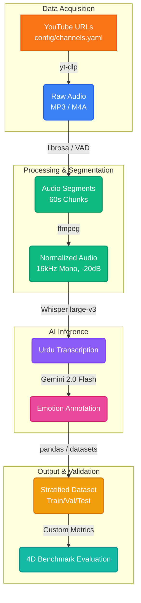

<div align="center">

```text
╔══════════════════════════════════════════════════════════════════════════╗
║                                                                          ║
║     ██╗   ██╗██████╗ ██████╗ ██╗   ██╗    ███████╗██████╗ ███████╗       ║
║     ██║   ██║██╔══██╗██╔══██╗██║   ██║    ██╔════╝██╔══██╗██╔════╝       ║
║     ██║   ██║██████╔╝██║  ██║██║   ██║    ███████╗██████╔╝█████╗         ║
║     ██║   ██║██╔══██╗██║  ██║██║   ██║    ╚════██║██╔═══╝ ██╔══╝         ║
║     ╚██████╔╝██║  ██║██████╔╝╚██████╔╝    ███████║██║     ███████╗       ║
║      ╚═════╝ ╚═╝  ╚═╝╚═════╝  ╚═════╝     ╚══════╝╚═╝     ╚══════╝       ║
║                                                                          ║
║              █████╗ ██╗                                                  ║
║             ██╔══██╗██║                                                  ║
║             ███████║██║                                                  ║
║             ██╔══██║██║                                                  ║
║             ██║  ██║██║                                                  ║
║             ╚═╝  ╚═╝╚═╝                                                  ║
║                                                                          ║
║          🎤  Speech AI for Urdu Poetry (Shayari)  📖                     ║
║                                                                          ║
╚══════════════════════════════════════════════════════════════════════════╝
```

<br>

[](https://python.org)
[](https://pytorch.org)
[](https://github.com/openai/whisper)
[](https://ai.google.dev)
[](LICENSE)
[](https://huggingface.co/docs/datasets)

<br>

**The first end-to-end pipeline for building emotion-annotated speech datasets**
**from professional Urdu poetry (*Shayari*) performances.**

*2,490+ recordings · 15 emotion classes · 4D benchmark evaluation · HuggingFace-ready*

---

```text
🎙️ YouTube → 🎵 Audio → ✂️ Segments → 🧹 Clean → 📝 Transcribe → 💭 Emotion → 📊 Dataset
```

</div>

---

## 📑 Table of Contents

- [📌 Why This Project Exists](#-why-this-project-exists)
- [🏗️ Pipeline Architecture](#-pipeline-architecture)
- [💭 Emotion Taxonomy (15 Classes)](#-emotion-taxonomy-15-classes)
- [📊 4D Benchmark Evaluation](#-4d-benchmark-evaluation)
- [📂 Repository Structure](#-repository-structure)
- [🚀 Getting Started](#-getting-started)
  - [⚡ Local Environment (Windows/Linux/Mac)](#-local-environment)
  - [☁️ Google Colab (GPU-Accelerated)](#-google-colab)
- [⚙️ Configuration](#️-configuration)
- [📦 Dataset Output Format](#-dataset-output-format)
- [🎵 Audio Data & Storage Strategy](#-audio-data--storage-strategy)
- [🔬 Methodology & Data Sources](#-methodology--data-sources)
- [🛠️ Tech Stack](#️-tech-stack)
- [📖 Detailed Script Usage](#-detailed-script-usage)
- [🤝 Contributing](#-contributing)
- [📈 Project Roadmap](#-project-roadmap)
- [📄 License & Acknowledgements](#-license--acknowledgements)

---

## 📌 Why This Project Exists

There is **no existing emotion-rich speech dataset** built from Urdu poetry performances. Urdu *Shayari* is unique — poets don't just recite, they **perform** with deliberate emotional delivery: heartbreak in a *ghazal*, rebellion in a *nazm*, divine longing in Sufi *kalam*. This project captures that essence and converts it into a machine-learning-ready format.

```text
┌──────────────────────────────────────────────────────────────┐
│                  THE PROBLEM WE SOLVE                        │
├──────────────────────────────────────────────────────────────┤
│                                                              │
│  🚫  No Urdu speech-emotion dataset from poetry exists       │
│  🚫  General ASR datasets miss poetic tonal nuances          │
│  🚫  Hindi-Urdu mixing degrades language-specific models     │
│                                                              │
│  ✅  We create 100-200 hrs of emotion-labeled Urdu audio     │
│  ✅  15-class emotion taxonomy designed for Shayari           │
│  ✅  4D benchmark ensures quality & linguistic authenticity   │
│                                                              │
└──────────────────────────────────────────────────────────────┘
```

### Key Focus Areas

| Focus | Description |
|:------|:------------|
| 🎭 **Tone & Delivery** | Capturing precise tonal variations that convey emotion in mushaira performances |
| 🎬 **Acting Quality** | Understanding what makes a poetry performance compelling and authentic |
| 💝 **Emotional Range** | Soulfulness, romance, rebellion, nostalgia — the full palette of Urdu expression |
| 🗣️ **Linguistic Purity** | Maintaining strict Urdu authenticity, measured against Hindi distance |

---

## 🏗️ Pipeline Architecture

This repository operates as a comprehensive, multi-stage data engine.



### Pipeline Steps at a Glance

| Step | Script | What It Does | Key Tech |
|:----:|:-------|:-------------|:---------|
| 1 | `src/batch_download.py` | Downloads audio from YouTube channels listed in YAML | `yt-dlp`, `ffmpeg` |
| 2 | `src/segment_audio.py` | Splits raw audio into 60s segments with VAD-aware silence boundaries | `librosa`, `numpy` |
| 3 | `src/preprocess_audio.py` | Normalizes to 16kHz mono, trims silence, loudness normalization | `librosa`, `soundfile` |
| 4 | `src/transcribe.py` | Transcribes Urdu speech using Whisper (forced `ur` language) | `openai-whisper` |
| 5 | `src/annotate_emotions.py` | AI-driven emotion classification using Google Gemini | `google-generativeai` |
| 6 | `src/build_dataset.py` | Assembles audio + transcript + emotion → stratified train/val/test | `pandas`, `datasets` |
| 7 | `src/evaluate.py` | 4D benchmark: Clarity, Fluency, Accent, Language Distance | `jiwer`, `librosa` |

---

## 💭 Emotion Taxonomy (15 Classes)

Our emotion taxonomy is specifically designed for Urdu poetry performances, capturing the cultural and linguistic nuances unique to *Shayari*:

```text
┌──────────────────────────────────────────────────────────────────┐
│                 🎭 EMOTION TAXONOMY — 15 CLASSES                 │
├──────────────────────────────────────────────────────────────────┤
│                                                                  │
│  ◆ ORIGINAL CORE (7)                                             │
│  ├── حسرت    Nostalgia      yearning for the past                │
│  ├── تعلق    Belonging      homeland, roots, identity            │
│  ├── خوشی    Joy            celebration, triumph                 │
│  ├── غم      Sorrow         grief, mourning                      │
│  ├── عشق     Romance        love, desire, devotion               │
│  ├── بغاوت   Rebellion      protest, defiance                    │
│  └── روحانیت Spirituality   Sufi themes, transcendence           │
│                                                                  │
│  ◆ EXPANDED (8)                                                  │
│  ├── دل شکستگی Heartbreak   betrayal, separation                 │
│  ├── عقیدت   Devotion       loyalty, sacrifice                   │
│  ├── آرزو    Longing        restless waiting, pining             │
│  ├── غصہ     Anger          rage, indignation                    │
│  ├── امید    Hope           optimism, resilience                 │
│  ├── اداسی   Melancholy     bittersweet, wistful                 │
│  ├── فخر     Pride          honor, dignity                       │
│  └── مایوسی  Despair        hopelessness, surrender              │
│                                                                  │
└──────────────────────────────────────────────────────────────────┘
```

| ID | اردو | English | Description | Keywords | Color |
|:---|:-----|:--------|:------------|:---------|:------|
| `nostalgia` | حسرت | Nostalgia | Yearning for the past, lost love, fading memories | یاد، ماضی، وہ دن، بچپن | 🟣 `#8B5CF6` |
| `belonging` | تعلق | Belonging | Connection, identity, homeland, roots | وطن، اپنا، مٹی، گھر | 🔵 `#06B6D4` |
| `joy` | خوشی | Joy | Celebration, happiness, triumph | خوشی، جشن، مسکراہٹ، بہار | 🟡 `#F59E0B` |
| `sorrow` | غم | Sorrow | Deep sadness, grief, mourning | غم، آنسو، درد، تنہائی | 🔵 `#3B82F6` |
| `romance` | عشق | Romance | Love, desire, passionate devotion | محبت، عشق، دل، چاہت | 🩷 `#EC4899` |
| `rebellion` | بغاوت | Rebellion | Protest, defiance, revolutionary spirit | انقلاب، آزادی، ظلم، آواز | 🔴 `#EF4444` |
| `spirituality` | روحانیت | Spirituality | Divine connection, Sufi themes | خدا، روح، فقیر، درویش | 🟢 `#10B981` |
| `heartbreak` | دل شکستگی | Heartbreak | Betrayal, shattered love, pain of separation | دھوکا، جدائی، بے وفائی | 🩷 `#BE185D` |
| `devotion` | عقیدت | Devotion | Unwavering loyalty, sacrifice | وفا، قربانی، سمرپن، ایثار | 🟣 `#7C3AED` |
| `longing` | آرزو | Longing | Deep desire, restless waiting | انتظار، تمنا، خواہش | 🟠 `#D97706` |
| `anger` | غصہ | Anger | Rage, frustration, burning indignation | غصہ، آگ، ناانصافی، قہر | 🔴 `#DC2626` |
| `hope` | امید | Hope | Optimism, resilience, dawn after darkness | امید، سویرا، صبح، حوصلہ | 🟢 `#059669` |
| `melancholy` | اداسی | Melancholy | Gentle sadness, bittersweet reflection | اداسی، سناٹا، خاموشی | 🔵 `#6366F1` |
| `pride` | فخر | Pride | Honor, dignity, self-respect | فخر، عزت، سر بلندی، وقار | 🟡 `#CA8A04` |
| `despair` | مایوسی | Despair | Hopelessness, existential grief, surrender | مایوسی، اندھیرا، تباہی | ⚫ `#475569` |

---

## 📊 4D Benchmark Evaluation

Every dataset produced by this pipeline is evaluated on **four dimensions** specifically designed for Urdu speech quality:

```text
╔══════════════════════════════════════════════════════════════════════╗
║                    4D BENCHMARK FRAMEWORK                            ║
╠══════════════════════════════════════════════════════════════════════╣
║                                                                      ║
║  ┌─────────────────────┐   ┌─────────────────────┐                   ║
║  │  1 ░ CLARITY        │   │  2 ░ FLUENCY        │                   ║
║  │                     │   │                     │                   ║
║  │  Word Error Rate    │   │  Pause distribution │                   ║
║  │  (WER via jiwer)    │   │  & rhythm analysis  │                   ║
║  │  How intelligible   │   │  How natural the    │                   ║
║  │  is the speech?     │   │  flow of speech is  │                   ║
║  └─────────────────────┘   └─────────────────────┘                   ║
║                                                                      ║
║  ┌─────────────────────┐   ┌─────────────────────┐                   ║
║  │  3 ░ ACCENT AUTH.   │   │  4 ░ LANG DISTANCE  │                   ║
║  │                     │   │                     │                   ║
║  │  Urdu phoneme       │   │  Lexical distance   │                   ║
║  │  coverage & script  │   │  from Hindi — keeps │                   ║
║  │  marker analysis    │   │  Urdu pure & clean  │                   ║
║  └─────────────────────┘   └─────────────────────┘                   ║
║                                                                      ║
║  Score range: 0.0 ────────────────────────── 1.0                     ║
║               ▓▓░░░░░░░░  poor    ▓▓▓▓▓▓▓▓▓░  excellent              ║
╚══════════════════════════════════════════════════════════════════════╝
```

---

## 📂 Repository Structure

```text
Urdu-Speech-Ai/
│
├── 📁 config/                        # Configuration files (YAML)
│   ├── settings.yaml                 #   Global pipeline settings
│   ├── channels.yaml                 #   YouTube channels & video links
│   └── emotions.yaml                 #   15-class emotion taxonomy
│
├── 📁 src/                           # Core pipeline scripts
│   ├── download_audio.py             #   Step 1a: Single video download
│   ├── batch_download.py             #   Step 1b: Batch channel download
│   ├── segment_audio.py              #   Step 2:  VAD-aware segmentation
│   ├── preprocess_audio.py           #   Step 3:  Audio normalization
│   ├── transcribe.py                 #   Step 4:  Whisper transcription
│   ├── annotate_emotions.py          #   Step 5:  Gemini emotion labels
│   ├── build_dataset.py              #   Step 6:  Dataset assembly
│   ├── evaluate.py                   #   Step 7:  4D benchmark scoring
│   └── utils.py                      #   Shared utilities & helpers
│
├── 📁 data/                          # Data directories (gitignored)
│   ├── raw/                          #   Downloaded MP3 files (managed via Git LFS)
│   ├── segments/                     #   60s audio segments
│   ├── processed/                    #   Normalized 16kHz WAV files
│   └── annotations/                  #   Transcript & emotion JSONs
│
├── 📁 notebooks/                     # Jupyter / Colab notebooks
│   └── Colab_Pipeline.ipynb          #   One-click Colab pipeline (T4 GPU)
│
├── 📁 models/                        # Downloaded model weights
├── 📁 results/                       # Evaluation reports & final dataset
├── 📁 logs/                          # Pipeline execution logs
│
├── .env.example                      # Environment template (API keys)
├── .gitignore                        # Excludes audio, models, data
├── requirements.txt                  # Python dependencies
├── Speech-AI-Urdu.pdf                # Project proposal document
└── README.md                         # ← You are here
```

---

## 🚀 Getting Started

### Prerequisites

| Requirement | Version | Purpose |
|:------------|:--------|:--------|
| Python | 3.10+ | Runtime |
| FFmpeg | 6.0+ | Audio processing |
| Git LFS | 3.0+ | Large file storage for audio |
| Gemini API Key | — | Emotion annotation ([Get one here](https://aistudio.google.com/apikey)) |

---

### ⚡ Local Environment (Windows/Linux/Mac)

```bash
# 1. Clone the repository
git clone https://github.com/code-with-idrees/Urdu-Speech-Ai.git
cd Urdu-Speech-Ai

# 2. (Optional) Initialize Git LFS if you want to pull existing audio
git lfs install
git lfs pull

# 3. Create & activate virtual environment (recommended)
python -m venv .venv
# On Windows:
.venv\Scripts\activate
# On Linux/Mac:
source .venv/bin/activate

# 4. Install dependencies
pip install -r requirements.txt

# 5. Configure environment
# On Windows:
copy .env.example .env
# On Linux/Mac:
cp .env.example .env

# Edit .env and set GEMINI_API_KEY=your_actual_key_here

# 6. Add YouTube links to config/channels.yaml (see template inside)

# 7. Run the pipeline step by step
python src/batch_download.py          # Download audio
python src/segment_audio.py           # Segment into 60s chunks
python src/preprocess_audio.py        # Normalize audio quality
python src/transcribe.py              # Transcribe with Whisper
python src/annotate_emotions.py       # Classify emotions with Gemini
python src/build_dataset.py           # Assemble final dataset
python src/evaluate.py --dataset results/dataset_test.json  # Evaluate
```

---

### ☁️ Google Colab (GPU-Accelerated)

The fastest way to run the full pipeline with **GPU-accelerated transcription**:

1. Upload the project folder to your Google Drive.
2. Open [`notebooks/Colab_Pipeline.ipynb`](notebooks/Colab_Pipeline.ipynb) in Colab.
3. Select **Runtime → Change runtime type → T4 GPU**.
4. Run all cells — Whisper transcription will be **10-50× faster**!

```text
┌──────────────────────────────────────────────────────────────┐
│                  ☁️  COLAB PIPELINE                           │
├──────────────────────────────────────────────────────────────┤
│                                                              │
│   📂 Upload to Drive  →  🔗 Open Notebook  →  ▶️ Run All     │
│                                                              │
│   • Mounts Google Drive for persistent storage               │
│   • Auto-installs FFmpeg + dependencies                      │
│   • Switches Whisper to CUDA (T4 GPU)                        │
│   • All data saved to your Drive                             │
│                                                              │
└──────────────────────────────────────────────────────────────┘
```

---

## ⚙️ Configuration

All major parameters live in `config/settings.yaml`:

```yaml
# Audio Processing
audio:
  sample_rate: 16000          # Hz — standard for speech models
  segment_duration_sec: 60    # Length of each segment
  segment_overlap_sec: 5      # Overlap between segments

# Transcription
transcription:
  model_name: "large-v3"      # Whisper model size
  language: "ur"              # Forced Urdu
  device: "cpu"               # Use "cuda" on GPU machines

# Emotion Annotation
annotation:
  gemini_model: "gemini-2.0-flash"
  temperature: 0.3            # Low for consistent labels
  min_confidence: 0.6         # Discard below this threshold

# Dataset Splits
dataset:
  train_split: 0.80
  val_split: 0.10
  test_split: 0.10
  output_format: "huggingface"
```

---

## 📦 Dataset Output Format

The pipeline produces a **HuggingFace-compatible dataset** with stratified emotion splits. A sample output record:

```json
{
  "segment_id": "rahat_indori_dQw4w9WgXcQ_003",
  "audio_path": "data/processed/rahat_indori_dQw4w9WgXcQ_003.wav",
  "transcript": "بلبل کو بے خار بھی کہتے ہیں باغباں",
  "poet": "Rahat Indori",
  "primary_emotion": "rebellion",
  "secondary_emotion": "pride",
  "confidence": 0.92,
  "human_verified": false
}
```

```text
┌──────────────────────────────────────────────────────┐
│               DATASET SPLITS                         │
├──────────────────────────────────────────────────────┤
│                                                      │
│   ████████████████████████████████████████  80%  TRAIN │
│   █████                                    10%  VAL   │
│   █████                                    10%  TEST  │
│                                                      │
│   Stratified by emotion class for balanced training  │
└──────────────────────────────────────────────────────┘
```

---

## 🎵 Audio Data & Storage Strategy

This project handles large volumes of raw audio (~14 GB / 2,490+ MP3 recordings). Audio files are managed with **Git LFS** to keep the repository lightweight:

```text
┌──────────────────────────────────────────────────────────────┐
│                 AUDIO STORAGE STRATEGY                       │
├──────────────────────────────────────────────────────────────┤
│                                                              │
│   📁 data/raw/       2,490 MP3s (~14 GB)  → Git LFS         │
│   📁 data/segments/  60s WAV chunks       → gitignored      │
│   📁 data/processed/ 16kHz normalized     → gitignored      │
│   📁 data/annotations/ JSON labels        → Git (small)     │
│                                                              │
│   💡 Only raw audio is version-controlled via LFS.           │
│      Intermediate files are regenerated by the pipeline.     │
│                                                              │
└──────────────────────────────────────────────────────────────┘
```

---

## 🔬 Methodology & Data Sources

Audio performances are sourced from Pakistani Urdu poetry YouTube channels, featuring established poets at professional gatherings.

```text
┌──────────────────────────────────────────────────────────────┐
│                    DATA SOURCES                              │
├──────────────────────────────────────────────────────────────┤
│                                                              │
│  🎙️ Mushaira Performances    Professional poetry gatherings  │
│  🎬 YouTube Channels          Curated Urdu poetry channels   │
│  🏛️ Literary Events           KEMU, UVAS, COMSATS mushairas │
│                                                              │
│  Featured Poets Include:                                     │
│  ├── Tehzeeb Hafi          ├── Abbas Tabish                  │
│  ├── Ali Zaryoun           ├── Ammar Iqbal                   │
│  ├── Ahmad Faraz           ├── Parveen Shakir                │
│  ├── Jaun Elia             ├── Habib Jalib                   │
│  ├── Faiz Ahmed Faiz       ├── Allama Iqbal                  │
│  └── ... and many more                                       │
│                                                              │
│  Target: 100-200 hours │ 1,000-2,000 labeled segments        │
└──────────────────────────────────────────────────────────────┘
```

### Emotion Annotation Workflow

```text
         ┌─────────────┐
         │  Transcript  │
         │  (Urdu text) │
         └──────┬───────┘
                │
                ▼
    ┌───────────────────────┐
    │   Gemini 2.0 Flash    │
    │   ──────────────────  │
    │   Structured Prompt   │
    │   with 15 emotions    │
    │   + confidence score  │
    └───────────┬───────────┘
                │
          ┌─────┴──────┐
          │            │
          ▼            ▼
   ┌────────────┐  ┌────────────┐
   │  conf ≥ 0.6│  │  conf < 0.6│
   │  ✅ Accept │  │  ❌ Discard│
   └────────────┘  └────────────┘
```

---

## 🛠️ Tech Stack

```text
┌──────────────────────────────────────────────────────────────┐
│                     TECHNOLOGY STACK                         │
├──────────────────────────────────────────────────────────────┤
│                                                              │
│  AUDIO DOWNLOAD       yt-dlp + ffmpeg                        │
│  ─────────────────────────────────────────────               │
│  AUDIO PROCESSING     librosa · soundfile · numpy · pydub    │
│  ─────────────────────────────────────────────               │
│  TRANSCRIPTION        OpenAI Whisper (large-v3) + PyTorch    │
│  ─────────────────────────────────────────────               │
│  EMOTION AI           Google Gemini 2.0 Flash                │
│  ─────────────────────────────────────────────               │
│  DATASET              HuggingFace datasets · pandas          │
│  ─────────────────────────────────────────────               │
│  EVALUATION           jiwer (WER) · custom 4D metrics        │
│  ─────────────────────────────────────────────               │
│  CONFIG               YAML · python-dotenv                   │
│  ─────────────────────────────────────────────               │
│  VISUALIZATION        matplotlib · seaborn                   │
│                                                              │
└──────────────────────────────────────────────────────────────┘
```

---

## 📖 Detailed Script Usage

<details>
<summary><b>📥 Step 1 — Download Audio</b></summary>

**Single video:**
```bash
python src/download_audio.py "https://www.youtube.com/watch?v=VIDEO_ID"
```

**Batch download from channels.yaml:**
```bash
python src/batch_download.py                        # Download all
python src/batch_download.py --poet "Tehzeeb Hafi"  # Single poet
python src/batch_download.py --limit 10             # First 10 only
```

*The batch downloader maintains a `manifest.json` to skip already-downloaded videos on re-runs.*
</details>

<details>
<summary><b>✂️ Step 2 — Segment Audio</b></summary>

```bash
python src/segment_audio.py                         # All files
python src/segment_audio.py --file "path/to/file"   # Single file
python src/segment_audio.py --no-vad                # Disable VAD
```

*Segments are 60s with 5s overlap. VAD (Voice Activity Detection) finds silence boundaries to avoid cutting mid-word.*
</details>

<details>
<summary><b>🧹 Step 3 — Preprocess Audio</b></summary>

```bash
python src/preprocess_audio.py
```

*Normalizes all segments to 16kHz mono WAV, trims leading/trailing silence, and applies loudness normalization (-20 dB target).*
</details>

<details>
<summary><b>📝 Step 4 — Transcribe</b></summary>

```bash
python src/transcribe.py                            # Default (large-v3)
python src/transcribe.py --model medium             # Smaller model
python src/transcribe.py --device cuda              # Force GPU
```

*Uses OpenAI Whisper with forced Urdu language for maximum accuracy. Falls back to CPU if CUDA unavailable.*
</details>

<details>
<summary><b>💭 Step 5 — Annotate Emotions</b></summary>

```bash
python src/annotate_emotions.py                     # Full annotation
python src/annotate_emotions.py --dry-run           # Preview prompts
```

*Requires `GEMINI_API_KEY` in `.env`. Uses structured prompts with retry logic and rate limiting.*
</details>

<details>
<summary><b>📊 Step 6 & 7 — Build Dataset & Evaluate</b></summary>

```bash
python src/build_dataset.py                         # HuggingFace JSON
python src/build_dataset.py --format csv            # CSV format

python src/evaluate.py --dataset results/dataset_test.json
```
</details>

---

## 🤝 Contributing

We welcome contributions! This project follows the **fork → branch → PR** workflow.

```text
┌──────────────────────────────────────────────────────────────┐
│                  CONTRIBUTION WORKFLOW                       │
├──────────────────────────────────────────────────────────────┤
│                                                              │
│   1. 🍴  Fork the repository                                │
│   2. 🌿  Create a feature branch                            │
│          git checkout -b feat/your-feature                   │
│   3. 💻  Make your changes                                   │
│   4. ✅  Ensure the pipeline runs end-to-end                 │
│   5. 📝  Commit with a clear message                         │
│          git commit -m "feat: add speaker diarization"       │
│   6. 🚀  Open a Pull Request                                │
│                                                              │
│   For major changes, open an issue first to discuss.         │
│                                                              │
└──────────────────────────────────────────────────────────────┘
```

### Commit Convention

| Prefix | Use For |
|:-------|:--------|
| `feat:` | New features |
| `fix:` | Bug fixes |
| `docs:` | Documentation updates |
| `data:` | Audio data additions/changes |
| `refactor:` | Code restructuring |
| `test:` | Tests |

---

## 📈 Project Roadmap

- [x] YouTube audio extraction pipeline
- [x] VAD-aware audio segmentation
- [x] Whisper transcription (large-v3, forced Urdu)
- [x] Gemini emotion annotation (15 classes)
- [x] 4D benchmark evaluation framework
- [x] HuggingFace-compatible dataset builder
- [x] Google Colab notebook with GPU support
- [ ] Multi-speaker diarization
- [ ] Human verification UI for emotion labels
- [ ] Demucs vocal isolation integration
- [ ] Voice-to-voice model training (AICO)
- [ ] Publish dataset on HuggingFace Hub
- [ ] Web-based annotation interface

---

## 📄 License & Acknowledgements

### License
This project is licensed under the **MIT License** — see the [LICENSE](LICENSE) file for details.

### Acknowledgements

| Project | Contribution |
|:--------|:-------------|
| [OpenAI Whisper](https://github.com/openai/whisper) | State-of-the-art speech-to-text |
| [Google Gemini](https://ai.google.dev) | AI emotion classification |
| [yt-dlp](https://github.com/yt-dlp/yt-dlp) | Reliable YouTube downloads |
| [librosa](https://librosa.org) | Audio analysis & processing |
| [HuggingFace](https://huggingface.co) | Dataset format & ecosystem |
| [jiwer](https://github.com/jitsi/jiwer) | Word Error Rate computation |

---

<div align="center">

```text
╔══════════════════════════════════════════════════════════════╗
║                                                              ║
║   "شاعری دل کی آواز ہے"                                       ║
║    Poetry is the voice of the heart.                         ║
║                                                              ║
╚══════════════════════════════════════════════════════════════╝
```

**Made with ❤️ for the Urdu poetry community**

*Star ⭐ this repo if you find it useful!*

</div>
