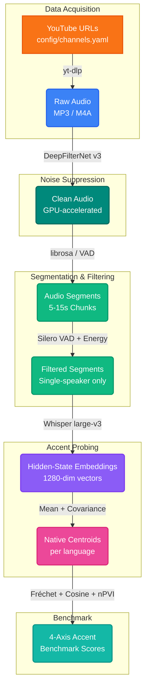

<div align="center">

```text
╔══════════════════════════════════════════════════════════════════════════╗
║                                                                          ║
║     ██╗   ██╗██████╗ ██████╗ ██╗   ██╗    ███████╗██████╗ ███████╗       ║
║     ██║   ██║██╔══██╗██╔══██╗██║   ██║    ██╔════╝██╔══██╗██╔════╝       ║
║     ██║   ██║██████╔╝██║  ██║██║   ██║    ███████╗██████╔╝█████╗         ║
║     ██║   ██║██╔══██╗██║  ██║██║   ██║    ╚════██║██╔═══╝ ██╔══╝         ║
║     ╚██████╔╝██║  ██║██████╔╝╚██████╔╝    ███████║██║     ███████╗       ║
║      ╚═════╝ ╚═╝  ╚═╝╚═════╝  ╚═════╝     ╚══════╝╚═╝     ╚══════╝       ║
║                                                                          ║
║              █████╗ ██╗                                                  ║
║             ██╔══██╗██║                                                  ║
║             ███████║██║                                                  ║
║             ██╔══██║██║                                                  ║
║             ██║  ██║██║                                                  ║
║             ╚═╝  ╚═╝╚═╝                                                  ║
║                                                                          ║
║   🎤 Accent Fidelity Benchmark for TTS — Urdu, Slavic & Germanic  🌍    ║
║                                                                          ║
╚══════════════════════════════════════════════════════════════════════════╝
```

<br>

[](https://python.org)
[](https://pytorch.org)
[](https://github.com/openai/whisper)
[](https://github.com/Rikorose/DeepFilterNet)
[](LICENSE)
[](https://neurips.cc)

<br>

**The first cross-lingual accent fidelity benchmark for TTS systems,**
**using Whisper hidden-state embeddings as language-agnostic accent probes.**

*Urdu · Polish · Czech · Russian · German · Dutch — 6 languages · 4 benchmark axes*

---

```text
🎙️ YouTube → 🧹 DeepFilterNet → ✂️ Segment → 🔇 Filter Audience → 🧠 Whisper Embeddings → 📐 Centroids → 📊 Benchmark
```

</div>

---

## 📑 Table of Contents

- [📌 Why This Project Exists](#-why-this-project-exists)
- [🔬 Core Contribution](#-core-contribution)
- [🏗️ Pipeline Architecture](#-pipeline-architecture)
- [📊 4-Axis Benchmark Framework](#-4-axis-benchmark-framework)
- [🌍 Target Languages](#-target-languages)
- [💭 Emotion Taxonomy (15 Classes)](#-emotion-taxonomy-15-classes)
- [📂 Repository Structure](#-repository-structure)
- [🚀 Getting Started](#-getting-started)
- [⚙️ Configuration](#️-configuration)
- [📦 Dataset Output Format](#-dataset-output-format)
- [🔗 Related Work](#-related-work)
- [🛠️ Tech Stack](#️-tech-stack)
- [📖 Detailed Script Usage](#-detailed-script-usage)
- [🤝 Contributing](#-contributing)
- [📈 Project Roadmap](#-project-roadmap)
- [📄 License & Acknowledgements](#-license--acknowledgements)

---

## 📌 Why This Project Exists

Standard TTS evaluation measures **intelligibility** (WER, CER) and **naturalness** (MOS, UTMOS) — but it does **not quantify accent fidelity**. A synthesizer can score perfectly on all four and still sound non-native on features that are phonemic in the target language.

[PSP-eval](https://github.com/praxelhq/psp-eval) demonstrated this for three Indic languages (Hindi, Telugu, Tamil) — showing that PSP ordering is *not monotonic* with WER ordering. **But no benchmark exists for Urdu, Slavic, or Germanic language families.** That's the gap.

```text
┌──────────────────────────────────────────────────────────────────┐
│                     THE GAP WE CLOSE                              │
├──────────────────────────────────────────────────────────────────┤
│                                                                    │
│  🚫  No accent fidelity benchmark for Urdu, Slavic, or Germanic  │
│  🚫  PSP-eval limited to 3 Indic langs with rule-based probes    │
│  🚫  WER/MOS miss accent — high intelligibility ≠ native accent  │
│                                                                    │
│  ✅  Language-agnostic probe via Whisper hidden-state embeddings  │
│  ✅  Native speaker centroids from professional performances      │
│  ✅  4-axis benchmark: Phoneme · Prosody · Centroid · Confusability│
│  ✅  First benchmark covering Urdu + Slavic + Germanic families   │
│                                                                    │
└──────────────────────────────────────────────────────────────────┘
```

### Key Insight

> Accent fidelity is **orthogonal** to intelligibility. Systems that lead on WER do not uniformly lead on retroflex fidelity, aspiration fidelity, or prosodic signature — a critical finding from PSP-eval that the community has largely missed.

---

## 🔬 Core Contribution

We propose using **Whisper's final hidden-state embeddings** as a language-agnostic accent probe. Whisper's encoder was trained on 680K hours across 97 languages — its hidden layers have implicitly learned cross-lingual phonetic representations.

```text
┌──────────────────────────────────────────────────────────────────┐
│                   WHY WHISPER HIDDEN STATES?                      │
├──────────────────────────────────────────────────────────────────┤
│                                                                    │
│  PSP-eval approach:                                                │
│    Rule-based phoneme probes → language-specific, noisy,           │
│    limited by CTC aligner quality per language                     │
│                                                                    │
│  Our approach:                                                     │
│    Whisper encoder → final hidden layer → mean-pool → 1280-dim    │
│    embedding → compute native centroid → Fréchet/cosine distance  │
│                                                                    │
│  Advantages:                                                       │
│    ✦ Language-agnostic: same probe for all 6 languages             │
│    ✦ No hand-coded rules: learned phonetic representations         │
│    ✦ Robust: Whisper trained on 680K hrs, 97 languages             │
│    ✦ Generalizable: extend to any language without new rules       │
│                                                                    │
└──────────────────────────────────────────────────────────────────┘
```

### Method Overview

```text
                    ┌─────────────────────────┐
                    │   Native Speaker Audio   │
                    │  (mushaira, broadcasts)  │
                    └────────────┬─────────────┘
                                 │
                    ┌────────────▼─────────────┐
                    │      DeepFilterNet v3     │
                    │   (noise suppression)     │
                    └────────────┬─────────────┘
                                 │
                    ┌────────────▼─────────────┐
                    │   Silero VAD + Filter     │
                    │  (remove audience noise)  │
                    └────────────┬─────────────┘
                                 │
                    ┌────────────▼─────────────┐
                    │  Whisper large-v3 Encoder │
                    │   → hidden state [T,1280] │
                    │   → mean pool → 1280-dim  │
                    └────────────┬─────────────┘
                                 │
                  ┌──────────────┴──────────────┐
                  │                              │
        ┌─────────▼──────────┐     ┌─────────────▼──────────┐
        │  Native Centroid    │     │  TTS Audio Embeddings   │
        │  μ + Σ (per lang)   │     │  (system under test)    │
        └─────────┬──────────┘     └─────────────┬──────────┘
                  │                              │
                  └──────────────┬──────────────┘
                                 │
                    ┌────────────▼─────────────┐
                    │   Benchmark Scoring       │
                    │  Cosine · Fréchet · nPVI  │
                    │  · Confusability Probe    │
                    └──────────────────────────┘
```

---

## 🏗️ Pipeline Architecture



### Pipeline Steps at a Glance

| Step | Script | What It Does | Key Tech |
|:----:|:-------|:-------------|:---------|
| 1 | `src/batch_download.py` | Downloads audio from YouTube channels listed in YAML | `yt-dlp`, `ffmpeg` |
| 2 | `src/enhance_audio.py` | GPU-accelerated noise suppression via DeepFilterNet v3 | `deepfilternet`, `torch` |
| 3 | `src/segment_audio.py` | Splits clean audio into 5-15s segments with VAD-aware boundaries | `librosa`, `numpy` |
| 4 | `src/filter_audience.py` | Removes segments with audience reactions / overlapping speakers | `silero-vad`, `whisper` |
| 5 | `src/preprocess_audio.py` | Normalizes to 16kHz mono, loudness normalization | `librosa`, `soundfile` |
| 6 | `src/transcribe.py` | Transcribes Urdu speech using Whisper (forced `ur` language) | `openai-whisper` |
| 7 | `src/extract_embeddings.py` | Extracts Whisper final hidden-state embeddings (1280-dim) | `openai-whisper`, `torch` |
| 8 | `src/compute_centroids.py` | Computes native speaker centroids (μ + Σ) per language | `numpy`, `scipy` |
| 9 | `src/accent_benchmark.py` | Scores TTS audio against native centroids on 4 axes | `numpy`, `scipy` |
| 10 | `src/evaluate.py` | Full benchmark evaluation with reporting | `jiwer`, custom metrics |

**Legacy pipeline steps** (emotion annotation, dataset building) are preserved for secondary contributions:

| Step | Script | What It Does | Key Tech |
|:----:|:-------|:-------------|:---------|
| — | `src/annotate_emotions.py` | AI-driven emotion classification using Google Gemini | `google-generativeai` |
| — | `src/build_dataset.py` | Assembles audio + transcript + emotion → stratified splits | `pandas`, `datasets` |

---

## 📊 4-Axis Benchmark Framework

Every TTS system is evaluated on **four dimensions** that together capture accent fidelity independently of intelligibility:

```text
╔══════════════════════════════════════════════════════════════════════╗
║                   4-AXIS ACCENT BENCHMARK                            ║
╠══════════════════════════════════════════════════════════════════════╣
║                                                                      ║
║  ┌─────────────────────────┐   ┌─────────────────────────┐           ║
║  │  1 ░ PHONEME FIDELITY   │   │  2 ░ PROSODIC SIGNATURE │           ║
║  │                         │   │      DIVERGENCE         │           ║
║  │  Language-specific      │   │                         │           ║
║  │  phonemic dimensions    │   │  F0 contour + nPVI      │           ║
║  │  (aspirated stops,      │   │  (rhythm, intonation    │           ║
║  │   retroflexes, etc.)    │   │   patterns)             │           ║
║  └─────────────────────────┘   └─────────────────────────┘           ║
║                                                                      ║
║  ┌─────────────────────────┐   ┌─────────────────────────┐           ║
║  │  3 ░ NATIVE CENTROID    │   │  4 ░ ACCENT             │           ║
║  │      DISTANCE           │   │      CONFUSABILITY      │           ║
║  │                         │   │                         │           ║
║  │  Whisper hidden-state   │   │  Can a trained probe    │           ║
║  │  Fréchet distance from  │   │  distinguish native     │           ║
║  │  native centroid        │   │  from TTS?              │           ║
║  └─────────────────────────┘   └─────────────────────────┘           ║
║                                                                      ║
║  Score range: 0.0 ────────────────────────── 1.0                     ║
║               ▓▓░░░░░░░░  poor    ▓▓▓▓▓▓▓▓▓░  native-like            ║
╚══════════════════════════════════════════════════════════════════════╝
```

### Axis Details

| Axis | Metric | What It Captures | Prior Art |
|:-----|:-------|:-----------------|:----------|
| **Phoneme Fidelity** | Language-specific phonemic probes | Retroflex, aspiration, gemination, uvular distinctions | PSP-eval RR/AF/LF |
| **Prosodic Signature** | F0 contour + nPVI divergence | Rhythm, stress patterns, intonation | PSP-eval PSD |
| **Native Centroid Distance** | Fréchet Audio Distance (Whisper embeddings) | Overall accent similarity to native speakers | **Novel (ours)** |
| **Accent Confusability** | Binary probe accuracy | Can a classifier tell native from TTS? | **Novel (ours)** |

---

## 🌍 Target Languages

### Phase 1: Urdu (Native Centroid Source)

| Dimension | Phonemic Features |
|:----------|:------------------|
| Aspirated stops | kh/k, gh/g distinctions |
| Retroflex series | ٹ ڈ ڑ (overlapping with Hindi but distinct lexical entries) |
| Gemination | Consonant length distinctions |
| Pharyngeal/uvular | ق vs ک, ع distinctions |
| Urdu-Hindi boundary | Language Distance metric (lexical separation) |

**Data source:** 2,490 professional mushaira recordings (this repository)

### Phase 2: Slavic Family — Polish, Czech, Russian

| Language | Key Phonemic Features |
|:---------|:---------------------|
| **Polish** | Palatal affricates (cz/sz/rz), nasal vowel contrast (ą/ę), stress-timed rhythm |
| **Czech** | Quantity-sensitive stress (long vowels ā/ē/ī/ū), the ř phoneme (/r̝/ — unique to Czech) |
| **Russian** | Vowel reduction (unstressed /o/ → /ə/), palatalization contrasts |

### Phase 3: Germanic Family — German, Dutch

| Language | Key Phonemic Features |
|:---------|:---------------------|
| **German** | Uvular /ʁ/, ich-laut/ach-laut distinction, vowel length pairs |
| **Dutch** | /ui/, /ei/, /ou/ diphthong cluster |

---

## 💭 Emotion Taxonomy (15 Classes)

> *Secondary contribution:* The dataset is also annotated with a 15-class emotion taxonomy designed for Urdu poetry performances.

<details>
<summary><b>Expand Emotion Taxonomy</b></summary>

```text
┌──────────────────────────────────────────────────────────────────┐
│                 🎭 EMOTION TAXONOMY — 15 CLASSES                 │
├──────────────────────────────────────────────────────────────────┤
│                                                                  │
│  ◆ ORIGINAL CORE (7)                                             │
│  ├── حسرت    Nostalgia      yearning for the past                │
│  ├── تعلق    Belonging      homeland, roots, identity            │
│  ├── خوشی    Joy            celebration, triumph                 │
│  ├── غم      Sorrow         grief, mourning                      │
│  ├── عشق     Romance        love, desire, devotion               │
│  ├── بغاوت   Rebellion      protest, defiance                    │
│  └── روحانیت Spirituality   Sufi themes, transcendence           │
│                                                                  │
│  ◆ EXPANDED (8)                                                  │
│  ├── دل شکستگی Heartbreak   betrayal, separation                 │
│  ├── عقیدت   Devotion       loyalty, sacrifice                   │
│  ├── آرزو    Longing        restless waiting, pining             │
│  ├── غصہ     Anger          rage, indignation                    │
│  ├── امید    Hope           optimism, resilience                 │
│  ├── اداسی   Melancholy     bittersweet, wistful                 │
│  ├── فخر     Pride          honor, dignity                       │
│  └── مایوسی  Despair        hopelessness, surrender              │
│                                                                  │
└──────────────────────────────────────────────────────────────────┘
```

| ID | اردو | English | Description |
|:---|:-----|:--------|:------------|
| `nostalgia` | حسرت | Nostalgia | Yearning for the past, lost love, fading memories |
| `belonging` | تعلق | Belonging | Connection, identity, homeland, roots |
| `joy` | خوشی | Joy | Celebration, happiness, triumph |
| `sorrow` | غم | Sorrow | Deep sadness, grief, mourning |
| `romance` | عشق | Romance | Love, desire, passionate devotion |
| `rebellion` | بغاوت | Rebellion | Protest, defiance, revolutionary spirit |
| `spirituality` | روحانیت | Spirituality | Divine connection, Sufi themes |
| `heartbreak` | دل شکستگی | Heartbreak | Betrayal, shattered love |
| `devotion` | عقیدت | Devotion | Unwavering loyalty, sacrifice |
| `longing` | آرزو | Longing | Deep desire, restless waiting |
| `anger` | غصہ | Anger | Rage, frustration, burning indignation |
| `hope` | امید | Hope | Optimism, resilience |
| `melancholy` | اداسی | Melancholy | Gentle sadness, bittersweet reflection |
| `pride` | فخر | Pride | Honor, dignity, self-respect |
| `despair` | مایوسی | Despair | Hopelessness, existential grief |

</details>

---

## 📂 Repository Structure

```text
Urdu-Speech-Ai/
│
├── 📁 config/                        # Configuration files (YAML)
│   ├── settings.yaml                 #   Global pipeline settings
│   ├── channels.yaml                 #   YouTube channels & video links
│   └── emotions.yaml                 #   15-class emotion taxonomy
│
├── 📁 src/                           # Core pipeline scripts
│   ├── download_audio.py             #   Step 1a: Single video download
│   ├── batch_download.py             #   Step 1b: Batch channel download
│   ├── enhance_audio.py              #   Step 2:  DeepFilterNet noise suppression
│   ├── segment_audio.py              #   Step 3:  VAD-aware segmentation (5-15s)
│   ├── filter_audience.py            #   Step 4:  Remove audience reactions
│   ├── preprocess_audio.py           #   Step 5:  Audio normalization
│   ├── transcribe.py                 #   Step 6:  Whisper transcription
│   ├── extract_embeddings.py         #   Step 7:  Whisper hidden-state extraction
│   ├── compute_centroids.py          #   Step 8:  Native speaker centroids
│   ├── accent_benchmark.py           #   Step 9:  Accent fidelity scoring
│   ├── evaluate.py                   #   Step 10: Full benchmark evaluation
│   ├── annotate_emotions.py          #   (Legacy) Gemini emotion labels
│   ├── build_dataset.py              #   (Legacy) Dataset assembly
│   └── utils.py                      #   Shared utilities & helpers
│
├── 📁 data/                          # Data directories (gitignored)
│   ├── raw/                          #   Downloaded MP3 files
│   ├── clean_raw/                    #   DeepFilterNet output
│   ├── segments/                     #   5-15s audio segments
│   ├── filtered_segments/            #   Clean single-speaker segments
│   ├── processed/                    #   Normalized 16kHz WAV files
│   ├── embeddings/                   #   Whisper hidden-state vectors
│   ├── centroids/                    #   Native speaker centroid files
│   └── annotations/                  #   Transcript & emotion JSONs
│
├── 📁 notebooks/                     # Jupyter / Colab notebooks
│   └── Colab_Pipeline.ipynb          #   One-click Colab pipeline
│
├── 📁 models/                        # Downloaded model weights
├── 📁 results/                       # Benchmark reports & final dataset
├── 📁 logs/                          # Pipeline execution logs
│
├── .env.example                      # Environment template (API keys)
├── .gitignore                        # Excludes audio, models, data
├── requirements.txt                  # Python dependencies
├── Speech-AI-Urdu.pdf                # Project proposal document
└── README.md                         # ← You are here
```

---

## 🚀 Getting Started

### Prerequisites

| Requirement | Version | Purpose |
|:------------|:--------|:--------|
| Python | 3.10+ | Runtime |
| NVIDIA GPU | 8GB+ VRAM | DeepFilterNet + Whisper inference |
| Miniconda | Latest | Environment management |
| FFmpeg | 6.0+ | Audio processing |
| Gemini API Key | — | Emotion annotation ([Get one here](https://aistudio.google.com/apikey)) |

---

### ⚡ Local Environment (Windows with GPU)

```bash
# 1. Clone the repository
git clone https://github.com/code-with-idrees/Urdu-Speech-Ai.git
cd Urdu-Speech-Ai

# 2. Create conda environment
conda create -n speech_ai python=3.10 -y
conda activate speech_ai

# 3. Install PyTorch with CUDA support
pip install torch torchvision torchaudio --index-url https://download.pytorch.org/whl/cu121

# 4. Install project dependencies
pip install -r requirements.txt
pip install deepfilternet

# 5. Configure environment
copy .env.example .env
# Edit .env and set GEMINI_API_KEY=your_actual_key_here

# 6. Run the pipeline
python src/batch_download.py          # 1. Download audio
python src/enhance_audio.py           # 2. DeepFilterNet noise suppression
python src/segment_audio.py           # 3. Segment into 5-15s chunks
python src/filter_audience.py         # 4. Remove audience reactions
python src/preprocess_audio.py        # 5. Normalize audio quality
python src/transcribe.py              # 6. Transcribe with Whisper
python src/extract_embeddings.py      # 7. Extract accent embeddings
python src/compute_centroids.py       # 8. Compute native centroids
python src/accent_benchmark.py        # 9. Score accent fidelity
python src/evaluate.py                # 10. Full benchmark report
```

---

### ☁️ Google Colab (GPU-Accelerated)

1. Upload the project folder to your Google Drive.
2. Open [`notebooks/Colab_Pipeline.ipynb`](notebooks/Colab_Pipeline.ipynb) in Colab.
3. Select **Runtime → Change runtime type → T4 GPU**.
4. Run all cells — Whisper + DeepFilterNet will use GPU acceleration.

---

## ⚙️ Configuration

All major parameters live in `config/settings.yaml`:

```yaml
# Audio Processing
audio:
  sample_rate: 16000          # Hz — standard for speech models
  segment_duration_sec: 10    # Length of each segment (5-15s for accent probing)
  segment_overlap_sec: 2      # Overlap between segments
  min_segment_duration_sec: 3 # Discard segments shorter than this

# Noise Suppression
enhancement:
  engine: "deepfilternet"     # DeepFilterNet v3
  chunk_seconds: 30           # GPU chunk size (prevents OOM)
  device: "cuda"              # "cuda" or "cpu"

# Audience Filtering
filtering:
  vad_threshold: 0.5          # Silero VAD speech probability threshold
  energy_variance_max: 15.0   # Max energy variance (dB) for clean segments
  whisper_min_confidence: -0.5 # Min avg log-prob for valid speech

# Transcription
transcription:
  model_name: "large-v3"      # Whisper model size
  language: "ur"              # Forced Urdu
  device: "cuda"              # Use "cuda" on GPU machines

# Accent Benchmark
accent:
  whisper_layer: -1           # Hidden layer to extract (-1 = final)
  embedding_dim: 1280         # Whisper large-v3 hidden dim
  centroid_min_samples: 100   # Minimum segments for centroid computation

# Emotion Annotation
annotation:
  gemini_model: "gemini-2.0-flash"
  temperature: 0.3
  min_confidence: 0.6

# Dataset Splits
dataset:
  train_split: 0.80
  val_split: 0.10
  test_split: 0.10
  output_format: "huggingface"
```

---

## 📦 Dataset Output Format

The pipeline produces a **HuggingFace-compatible dataset** with accent embeddings, emotion labels, and benchmark scores:

```json
{
  "segment_id": "rahat_indori_dQw4w9WgXcQ_003",
  "audio_path": "data/filtered_segments/rahat_indori_dQw4w9WgXcQ_003.wav",
  "transcript": "بلبل کو بے خار بھی کہتے ہیں باغباں",
  "poet": "Rahat Indori",
  "language": "ur",
  "embedding_path": "data/embeddings/rahat_indori_dQw4w9WgXcQ_003.npy",
  "primary_emotion": "rebellion",
  "confidence": 0.92,
  "accent_scores": {
    "phoneme_fidelity": 0.87,
    "prosodic_divergence": 0.12,
    "centroid_distance": 0.95,
    "confusability": 0.91
  }
}
```

---

## 🔗 Related Work

| Project | Relationship |
|:--------|:-------------|
| [PSP-eval](https://github.com/praxelhq/psp-eval) | Closest prior work — accent fidelity for Indic TTS. Our Whisper-based approach generalizes their methodology |
| [DeepFilterNet](https://github.com/Rikorose/DeepFilterNet) | Noise suppression preprocessing — removes recording artifacts before accent probing |
| [OpenAI Whisper](https://github.com/openai/whisper) | Foundation model for both transcription and accent embedding extraction |
| [Common Voice](https://commonvoice.mozilla.org/) | Potential data source for EU language native speaker centroids |
| [VoxPopuli](https://github.com/facebookresearch/voxpopuli) | EU parliamentary speech — potential German/Dutch reference data |

---

## 🛠️ Tech Stack

```text
┌──────────────────────────────────────────────────────────────┐
│                     TECHNOLOGY STACK                         │
├──────────────────────────────────────────────────────────────┤
│                                                              │
│  AUDIO DOWNLOAD       yt-dlp + ffmpeg                        │
│  ─────────────────────────────────────────────               │
│  NOISE SUPPRESSION    DeepFilterNet v3 (GPU)                 │
│  ─────────────────────────────────────────────               │
│  AUDIO PROCESSING     librosa · soundfile · numpy · pydub    │
│  ─────────────────────────────────────────────               │
│  VAD / FILTERING      Silero VAD · energy analysis           │
│  ─────────────────────────────────────────────               │
│  TRANSCRIPTION        OpenAI Whisper (large-v3) + PyTorch    │
│  ─────────────────────────────────────────────               │
│  ACCENT PROBING       Whisper hidden states · Fréchet dist.  │
│  ─────────────────────────────────────────────               │
│  EMOTION AI           Google Gemini 2.0 Flash                │
│  ─────────────────────────────────────────────               │
│  DATASET              HuggingFace datasets · pandas          │
│  ─────────────────────────────────────────────               │
│  EVALUATION           jiwer (WER) · scipy · custom metrics   │
│  ─────────────────────────────────────────────               │
│  CONFIG               YAML · python-dotenv                   │
│  ─────────────────────────────────────────────               │
│  VISUALIZATION        matplotlib · seaborn                   │
│                                                              │
└──────────────────────────────────────────────────────────────┘
```

---

## 📖 Detailed Script Usage

<details>
<summary><b>📥 Step 1 — Download Audio</b></summary>

**Single video:**
```bash
python src/download_audio.py "https://www.youtube.com/watch?v=VIDEO_ID"
```

**Batch download from channels.yaml:**
```bash
python src/batch_download.py                        # Download all
python src/batch_download.py --poet "Tehzeeb Hafi"  # Single poet
python src/batch_download.py --limit 10             # First 10 only
```

*The batch downloader maintains a `manifest.json` to skip already-downloaded videos on re-runs.*
</details>

<details>
<summary><b>🧹 Step 2 — DeepFilterNet Noise Suppression</b></summary>

```bash
python src/enhance_audio.py
```

*Uses DeepFilterNet v3 with GPU acceleration. Processes in 30-second chunks to prevent CUDA OOM. Streams from disk for files >1 hour. Outputs to `data/clean_raw/`.*
</details>

<details>
<summary><b>✂️ Step 3 — Segment Audio</b></summary>

```bash
python src/segment_audio.py                         # All files
python src/segment_audio.py --file "path/to/file"   # Single file
python src/segment_audio.py --duration 10           # 10-second segments
python src/segment_audio.py --no-vad                # Disable VAD
```

*Segments are 5-15s with VAD-aware boundaries to avoid cutting mid-word.*
</details>

<details>
<summary><b>🔇 Step 4 — Filter Audience Reactions</b></summary>

```bash
python src/filter_audience.py
```

*Automatically detects and discards segments containing audience reactions ("wah wah", "kya kehne", clapping) using Silero VAD, energy variance analysis, and Whisper confidence filtering. Clean single-speaker segments are saved to `data/filtered_segments/`.*
</details>

<details>
<summary><b>📝 Steps 5-6 — Preprocess & Transcribe</b></summary>

```bash
python src/preprocess_audio.py
python src/transcribe.py --device cuda
```
</details>

<details>
<summary><b>🧠 Steps 7-9 — Accent Probing</b></summary>

```bash
python src/extract_embeddings.py      # Extract 1280-dim Whisper embeddings
python src/compute_centroids.py       # Compute native centroids (μ + Σ)
python src/accent_benchmark.py        # Score TTS systems against centroids
```
</details>

<details>
<summary><b>📊 Step 10 — Full Evaluation</b></summary>

```bash
python src/evaluate.py --dataset results/dataset_test.json
```
</details>

---

## 🤝 Contributing

We welcome contributions! This project follows the **fork → branch → PR** workflow.

```text
┌──────────────────────────────────────────────────────────────┐
│                  CONTRIBUTION WORKFLOW                       │
├──────────────────────────────────────────────────────────────┤
│                                                              │
│   1. 🍴  Fork the repository                                │
│   2. 🌿  Create a feature branch                            │
│          git checkout -b feat/your-feature                   │
│   3. 💻  Make your changes                                   │
│   4. ✅  Ensure the pipeline runs end-to-end                 │
│   5. 📝  Commit with a clear message                         │
│          git commit -m "feat: add Czech accent probes"       │
│   6. 🚀  Open a Pull Request                                │
│                                                              │
│   For major changes, open an issue first to discuss.         │
│                                                              │
└──────────────────────────────────────────────────────────────┘
```

### Commit Convention

| Prefix | Use For |
|:-------|:--------|
| `feat:` | New features |
| `fix:` | Bug fixes |
| `docs:` | Documentation updates |
| `data:` | Audio data additions/changes |
| `bench:` | Benchmark-related changes |
| `refactor:` | Code restructuring |
| `test:` | Tests |

---

## 📈 Project Roadmap

### ✅ Completed
- [x] YouTube audio extraction pipeline (2,490+ recordings)
- [x] DeepFilterNet v3 noise suppression (GPU-accelerated)
- [x] VAD-aware audio segmentation
- [x] Whisper transcription (large-v3, forced Urdu)
- [x] Gemini emotion annotation (15 classes)
- [x] 4D benchmark evaluation framework (legacy)
- [x] HuggingFace-compatible dataset builder
- [x] Google Colab notebook with GPU support

### 🔨 In Progress
- [ ] Audience reaction filter (remove "wah wah" / "kya kehne")
- [ ] Whisper hidden-state embedding extraction
- [ ] Native speaker centroid computation (Urdu)

### 🗺️ Planned
- [ ] 4-axis accent benchmark scoring engine
- [ ] EU language data sourcing (Polish, Czech, Russian, German, Dutch)
- [ ] Cross-model benchmark results (comparable to PSP-eval Table 1)
- [ ] Accent confusability probe (binary native vs. TTS classifier)
- [ ] NeurIPS 2026 submission
- [ ] Publish benchmark + centroids on HuggingFace Hub

---

## 📄 License & Acknowledgements

### License
This project is licensed under the **MIT License** — see the [LICENSE](LICENSE) file for details.

### Acknowledgements

| Project | Contribution |
|:--------|:-------------|
| [PSP-eval (praxelhq)](https://github.com/praxelhq/psp-eval) | Foundational accent fidelity methodology for Indic languages |
| [DeepFilterNet (Rikorose)](https://github.com/Rikorose/DeepFilterNet) | Real-time speech enhancement / noise suppression |
| [OpenAI Whisper](https://github.com/openai/whisper) | Speech-to-text + hidden-state accent embeddings |
| [Google Gemini](https://ai.google.dev) | AI emotion classification |
| [yt-dlp](https://github.com/yt-dlp/yt-dlp) | Reliable YouTube downloads |
| [librosa](https://librosa.org) | Audio analysis & processing |
| [HuggingFace](https://huggingface.co) | Dataset format & ecosystem |
| [jiwer](https://github.com/jitsi/jiwer) | Word Error Rate computation |
| [LAION AI](https://laion.ai/) | Research collaboration & guidance |

---

<div align="center">

```text
╔══════════════════════════════════════════════════════════════╗
║                                                              ║
║   "شاعری دل کی آواز ہے"                                       ║
║    Poetry is the voice of the heart.                         ║
║                                                              ║
║   — and its accent tells you where the heart calls home.     ║
║                                                              ║
╚══════════════════════════════════════════════════════════════╝
```

**Made with ❤️ for the speech AI research community**

*Star ⭐ this repo if you find it useful!*

</div>
